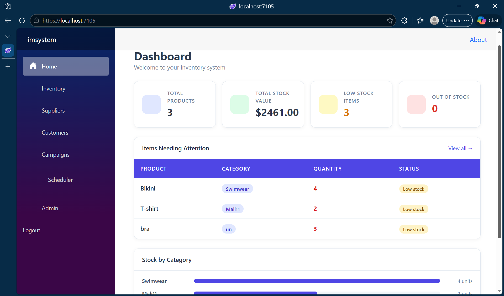
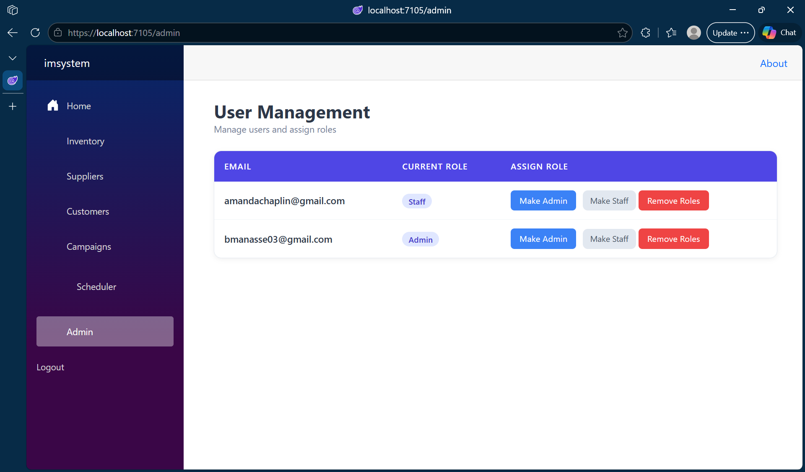

# Inventory Management System

A full-stack web application built using Blazor, ASP.NET Core, SQL Server, and SendGrid.
This system is designed to manage inventory, users, and customer communication while supporting real-world business workflows such as stock tracking, role-based access, and email campaigns.

---

## Overview

The application simulates a real business environment by combining inventory management, user administration, and customer engagement tools into a single platform. It demonstrates full-stack development, secure authentication, and workflow-driven system design.

---

## Features

* **Dashboard**
  Displays real-time inventory insights including total products, stock value, low stock alerts, and category breakdowns

* **Inventory Management**
  Full CRUD operations with structured data handling for products and categories

* **Supplier Management**
  Track and manage supplier relationships linked to inventory items

* **Customer Management**
  Maintain a list of customers for communication and marketing

* **Email Campaigns**
  Create and send bulk emails using SendGrid integration

* **Task Scheduler**
  Manage tasks with priorities and due dates to support operational workflows

* **User Authentication**
  Secure login and registration using ASP.NET Identity

* **Role-Based Access Control**
  Admin and Staff roles with controlled permissions

* **Admin Panel**
  Manage users and assign roles dynamically

---

## Tech Stack

| Layer             | Technology                        |
| ----------------- | --------------------------------- |
| Frontend          | Blazor Server, HTML, CSS          |
| Backend           | ASP.NET Core, C#                  |
| Database          | SQL Server, Entity Framework Core |
| Authentication    | ASP.NET Identity                  |
| Email Integration | SendGrid API                      |
| Tools             | Visual Studio 2022, Git, GitHub   |

---

## Key Highlights

* Built a full-stack system with authentication, role management, and multiple business modules
* Managed multiple entities including inventory items, users, suppliers, and customers
* Implemented structured workflows for inventory tracking, communication, and task management
* Designed a dashboard with real-time insights and alerts for decision-making
* Applied dependency injection and asynchronous programming to improve performance
* Demonstrates debugging, system design, and real-world application architecture

---

## AI and Workflow Integration

* Utilized AI-assisted development tools to improve coding efficiency and debugging
* Designed workflow-based features for inventory tracking, user management, and email campaigns
* Simulates real-world business processes and operational decision-making systems

---

## Getting Started

1. Clone the repository
2. Update `appsettings.json` with your SQL Server connection string and SendGrid API key
3. Run `Update-Database` in Package Manager Console
4. Press F5 to run the application

---

## Screenshots

---

## Author

Betty Manasse
GitHub: https://github.com/Bettymali
